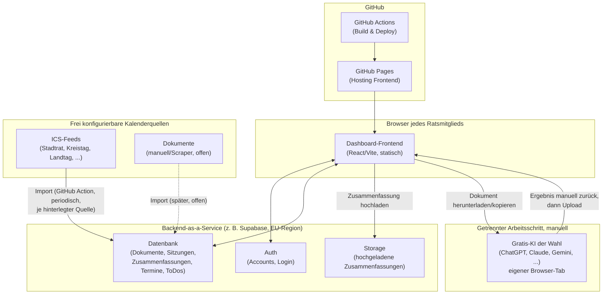

# Konzept: MandatsCockpit – Interaktives Dashboard für Mandatsträger

Stand: 17.07.2026 · Entwurf v4

**Projektname:** Entschieden – **MandatsCockpit** (Repo-Name: `mandatscockpit`). Frühere Arbeitstitel waren „RatsCockpit", „GremienCockpit" oder „PolitCockpit" – der Name ist jederzeit ohne Aufwand austauschbar, betrifft nur Repo-/Titel-Strings.

## 1. Ausgangslage

- Zielgruppe: primär die Mitglieder des Stadtrats Iserlohn, jeweils mit eigenem Nutzeraccount. Die Architektur ist aber bewusst **nicht auf den Stadtrat beschränkt**: Wer zusätzlich (oder stattdessen) im Kreistag, Landtag oder Bundestag sitzt, kann die jeweiligen Sitzungskalender genauso einbinden – dazu mehr in Abschnitt 5.3.
- Datenbasis: ausschließlich öffentlich zugängliche Anträge, Sitzungsvorlagen und Dokumente. Keine vertraulichen Sitzungsinhalte im System.
- Jedes Mitglied analysiert, erstellt und fasst Dokumente mit einer **eigenen KI seiner Wahl** zusammen – und zwar **lokal, außerhalb des Dashboards**, mit den kostenlosen Web-Oberflächen von ChatGPT, Claude, Gemini & Co. (keine kostenpflichtigen API-Keys nötig, die die meisten Mitglieder ohnehin nicht haben).
- Jedes Mitglied pflegt einen **eigenen Kalender** – mit frei konfigurierbaren Sitzungsterminen aus einer oder mehreren Ebenen sowie zusätzlich frei eintragbaren, rein persönlichen Terminen – und eigene **ToDos**. Beides ist rein persönlich, nicht für andere einsehbar.
- Zielplattform: ein GitHub-Projekt (Repository), das das Dashboard als Web-App bereitstellt.

Diese Einschränkung auf öffentliche Dokumente vereinfacht die Architektur erheblich: Für die Dokumente selbst entfällt das Vertraulichkeitsproblem. Weiterhin personenbezogen und damit DSGVO-relevant bleiben aber die Accounts, Kalendereinträge, ToDos und hochgeladenen Zusammenfassungen der einzelnen Mitglieder – dafür braucht es sauberen Zugriffsschutz (siehe Abschnitt 8).

## 2. Architektur im Überblick

Drei Schichten, bewusst lose gekoppelt. Wichtigste Änderung gegenüber einer API-Lösung: **keine direkte Verbindung zu einem KI-Anbieter.** Jedes Mitglied nutzt seine KI wie gewohnt in einem separaten Browser-Tab (kostenlose Version) und lädt nur das fertige Ergebnis als Datei ins Dashboard hoch.



Kernidee: Das Frontend ist eine statische Web-App auf GitHub Pages. Accounts, Kalender, ToDos und Zusammenfassungen liegen in einer kleinen Backend-Datenbank (empfohlen: Supabase, europäisch hostbar). Die KI-Nutzung selbst passiert **komplett außerhalb des Dashboards** – jedes Mitglied lädt ein Dokument herunter oder kopiert den Text, lässt es von seiner bevorzugten (kostenlosen) KI analysieren und lädt danach nur das Ergebnis als Datei hoch. Damit entfällt jede Notwendigkeit für API-Keys, kostenpflichtige Zugänge oder eine technische KI-Anbindung im Projekt selbst.

## 3. Technologie-Empfehlung

| Bereich | Empfehlung | Warum |
|---|---|---|
| Frontend | React + Vite (oder Next.js static export), Tailwind | Läuft komplett statisch, passt zu GitHub Pages |
| Hosting Frontend | GitHub Pages | Kostenlos, direkt aus dem Repo, Teil des „GitHub-Projekts" |
| CI/CD | GitHub Actions | Automatischer Build & Deploy bei jedem Push |
| Auth + Datenbank | Supabase (Postgres, EU-Frankfurt) | Fertige Nutzerverwaltung, Row-Level-Security, Free-Tier reicht für einen Stadtrat |
| Datei-Ablage | Supabase Storage | Für hochgeladene Zusammenfassungen (txt/md/pdf) und Anhänge |
| KI-Integration | Keine – bewusst außerhalb des Systems | Jedes Mitglied nutzt seine kostenlose KI-Oberfläche unabhängig, kein API-Key, keine laufenden Kosten |
| Drag & Drop (ToDo-Board) | `@dnd-kit/core` | Leichtgewichtig, React-kompatibel, für frei definierbare Kanban-Spalten geeignet |

**Ist Supabase kostenlos?** Ja – der Free-Plan kostet $0/Monat und umfasst 500 MB Datenbank, 1 GB Datei-Speicher, 50.000 monatlich aktive Nutzer, unbegrenzte API-Requests und 5 GB Egress. Für einen Stadtrat mit ein paar Dutzend Mitgliedern reicht das bei Weitem. Zwei Einschränkungen sind für dieses Projekt relevant: Es sind maximal 2 aktive Projekte gleichzeitig erlaubt (kein Problem, ein Projekt reicht), und **ein kostenloses Projekt pausiert automatisch nach 1 Woche Inaktivität** und muss dann manuell reaktiviert werden. Da das Dashboard zwischen Sitzungen ruhiger genutzt werden könnte, empfiehlt sich ein kleiner „Keep-Alive"-Trick: ein GitHub Action Workflow, der z. B. alle 5 Tage automatisch eine harmlose Anfrage an die Datenbank schickt, damit sie nicht einschläft. Sollte das Projekt doch einmal wachsen, kostet der nächste Schritt (Pro-Plan) $25/Monat und hebt alle Limits deutlich an (u. a. kein Pausieren mehr, 8 GB Datenbank, tägliche Backups).

**Warum nicht einfach eine SQL-Datenbank direkt bei GitHub einbinden?** Das geht leider nicht – GitHub selbst bietet keinerlei Datenbank-Hosting an. GitHub Pages liefert ausschließlich statische Dateien (HTML/CSS/JS) aus; es gibt dort keine Serverkomponente, die eine SQL-Datenbank betreiben oder Schreibzugriffe von vielen Nutzern gleichzeitig entgegennehmen könnte. Man könnte zwar eine SQLite-Datei direkt im Repo ablegen, aber das funktioniert nur für einzelne, nacheinander laufende Schreibvorgänge (z. B. über GitHub Actions) – nicht für eine Web-App, in der mehrere Ratsmitglieder gleichzeitig eigene Termine und ToDos eintragen. Dafür braucht es zwingend einen separaten, dauerhaft erreichbaren Datenbank-Dienst wie Supabase.

Reine Datenbank-Alternativen zu Supabase, falls Auth/Storage separat gelöst werden sollen: **Neon** (serverloses Postgres, großzügiger Free-Tier, aber kein eingebautes Auth/Storage – müsste selbst ergänzt werden, z. B. über GitHub-OAuth) oder **Turso** (SQLite-basiert, sehr großzügiger Free-Tier, git-ähnliches Branching-Konzept). Beide sind schlanker als Supabase, bedeuten aber mehr Eigenbau bei Login und Datei-Uploads – für dieses Projekt bleibt Supabase wegen der eingebauten Nutzerverwaltung die pragmatischste Wahl. Alternative mit eigenem Server: Firebase (Google) – funktional vergleichbar, aber Serverstandort/Datentransfer in die USA ist bei personenbezogenen Daten genauer zu prüfen.

## 4. Nutzerrollen

- **Mitglied** (Standardrolle): sieht öffentliche Dokumente, abonniert in den eigenen Einstellungen seine Kalenderquellen/Gremien (auch über Iserlohn hinaus, z. B. Kreistag), verwaltet eigenen Kalender und eigenes ToDo-Board, lädt eigene Zusammenfassungen hoch.
- **Fraktionsbüro**: zusätzliche Rolle mit Schreibrecht auf den Kalender der Mitglieder der eigenen Fraktion – kann dort Termine eintragen (z. B. Fraktionssitzungen, externe Termine), sieht aber keine ToDos oder Zusammenfassungen der Mitglieder.
- **Ratsbüro/Admin**: legt Accounts an, pflegt die gemeinsame Grundausstattung an Kalenderquellen, markiert die jeweils aktive Sitzung, verwaltet den Dokumenten-Import.

## 5. Kernmodule

### 5.1 Dokumenten-Hub
Zentrale, durchsuchbare Ablage aller öffentlichen Anträge und Sitzungsvorlagen. Idealerweise automatisch importiert aus dem städtischen Ratsinformationssystem (RSS-Feed, offene Schnittstelle oder – falls nichts davon existiert – ein einfacher Scraper/CSV-Import). Filterbar nach Ausschuss, Sitzung, Datum und Thema, mit Volltextsuche und einem Download-Button für die lokale Weiterverarbeitung.

**Iserlohn konkret:** Die Stadt nutzt das Ratsinformationssystem **ALLRIS** (Domain-Muster `iserlohn.sitzung-online.de`, dasselbe System wie z. B. Bonn oder Boppard). Der öffentliche RSS-Feed war beim Testen nicht brauchbar. Ein automatischer Import der Antragstexte selbst ist damit vorerst nicht gesichert – hier bleibt zunächst der manuelle Import/Scraper als Fallback (siehe Abschnitt 11).

Für den **Sitzungskalender** gibt es dagegen eine zuverlässige, weil standardisierte Quelle: den ICS-Kalender-Abo-Link `public/ics/SiKalAbo.ics` (siehe Abschnitt 5.3) – darüber lassen sich Sitzungstermine automatisch einlesen.

### 5.2 Zusammenfassungs-Upload (statt KI-API)
Der Workflow läuft in zwei Schritten:

1. **Offline/extern:** Das Mitglied lädt ein Dokument herunter oder kopiert den Text, öffnet seine bevorzugte kostenlose KI (ChatGPT, Claude, Gemini, Copilot, …) in einem eigenen Tab und lässt sich dort eine Zusammenfassung, Analyse oder Stellungnahme erstellen. Das passiert komplett außerhalb des Dashboards, mit dem Werkzeug der eigenen Wahl.
2. **Upload:** Das Ergebnis (Text einfügen oder als .txt/.md/.pdf hochladen) wird im Dashboard mit dem jeweiligen Dokument und der zugehörigen Sitzung verknüpft.

Im Dashboard erscheinen die hochgeladenen Zusammenfassungen gebündelt in der **Sitzungsdetailsicht** der jeweiligen Sitzung (siehe Abschnitt 5.5) – so hat jedes Mitglied vor einer Sitzung auf einen Blick alle (eigenen) Zusammenfassungen zu den anstehenden Tagesordnungspunkten.

*Offene Frage (siehe Abschnitt 11):* Sollen Zusammenfassungen nur für das hochladende Mitglied sichtbar sein (analog zu Kalender/ToDos), oder für alle Mitglieder freigegeben werden können, damit man sich gegenseitig Arbeit abnimmt? Beides ist mit dem Datenmodell unten leicht abbildbar – im MVP wird „privat mit optionalem Teilen-Button" empfohlen.

### 5.3 Sitzungskalender & persönlicher Kalender
Der Kalender jedes Mitglieds setzt sich aus zwei Quellen zusammen, die in einer Ansicht zusammenlaufen:

1. **Importierte Sitzungstermine** aus einer oder mehreren konfigurierten Kalenderquellen (siehe unten).
2. **Frei eingetragene Termine** – ganz normale manuelle Terminverwaltung, unabhängig von jeder externen Quelle. Diese können sowohl vom Mitglied selbst als auch vom **Fraktionsbüro** für die einzelnen Mitglieder der eigenen Fraktion angelegt werden (z. B. Fraktionssitzungen, Presse- oder Ortstermine). Vom Fraktionsbüro angelegte Termine sind im Kalender des Mitglieds klar als solche gekennzeichnet; das Mitglied kann sie wie eigene Termine bearbeiten oder absagen. Sichtbar bleiben sie – wie alle Kalendereinträge – ausschließlich für das betroffene Mitglied und das eintragende Fraktionsbüro, nicht für andere Mitglieder oder Fraktionen.

Ein iCal-Export erlaubt zusätzlich die Synchronisation des kompletten, zusammengeführten Kalenders mit Google-, Outlook- oder Apple-Kalender.

**Frei konfigurierbare Kalenderquellen:** Statt fest auf Iserlohn/ALLRIS verdrahtet zu sein, verwaltet das System eine Liste von `CalendarSource`-Einträgen – jede mit Name, Ebene (Kommune/Kreis/Land/Bund) und einer ICS-URL. Das Ratsbüro pflegt eine gemeinsame Grundausstattung (allen voran der Iserlohner Stadtrats-Feed `public/ics/SiKalAbo.ics`, ein offenes, gut dokumentiertes Standardformat nach RFC 5545 mit robusten Bibliotheken in jeder Sprache, z. B. `node-ical`, `ical.js`). Jedes Mitglied kann zusätzlich **eigene Quellen hinzufügen** – etwa den Sitzungskalender seines Kreistags, sofern der ebenfalls eine ICS-URL anbietet, oder allgemeiner die Sitzungswochen-Kalender von Landtag/Bundestag, sofern diese in einem abonnierbaren Format vorliegen. Jede hinterlegte Quelle wird per GitHub Action periodisch importiert und befüllt die `Session`-Tabelle, getaggt mit Ebene und – wo aus dem `SUMMARY`-Feld herauslesbar (z. B. „Bauausschuss – Sitzung") – dem Gremium.

**Wichtige Einschränkung:** Nicht jedes Parlament bietet einen einfachen ICS-Feed pro Mitglied – Landtage und der Bundestag veröffentlichen Sitzungstermine oft nur als allgemeinen Plenarkalender oder über eigene (Open-Data-)Schnittstellen, teils gar nicht maschinenlesbar. Die „frei konfigurierbar"-Architektur deckt jeden Fall ab, in dem irgendeine ICS-URL existiert; wo keine existiert, bleibt der manuelle Termineintrag die Lösung – genau dafür gibt es ja ohnehin die persönliche Terminverwaltung aus Punkt 2 oben.

**Gremien-/Quellen-Auswahl je Mitglied:** Jedes Mitglied abonniert in seinem Profil die für sich relevanten Quellen (z. B. „Stadtrat Iserlohn" + „Kreistag Märkischer Kreis") und wählt innerhalb dieser optional noch einzelne Gremien/Ausschüsse aus. Der Kalender zeigt dann automatisch nur die relevanten Termine an.

### 5.4 ToDo-Board (Kanban)
Statt einer einfachen Liste bekommt jedes Mitglied ein eigenes, Jira/Trello-artiges Board: ToDo-Karten lassen sich per Drag & Drop zwischen **frei definierbaren Spalten** verschieben (keine festen Status wie „Offen/Erledigt", sondern vom Mitglied selbst benannte und sortierte Spalten, z. B. „Diese Woche", „Warte auf Rückmeldung", „Erledigt"). Karten können optional mit einem Dokument und/oder einer Sitzung verknüpft werden. Rein persönlich, kein Abgleich mit anderen Mitgliedern nötig.

Technisch empfiehlt sich eine schlanke Drag-&-Drop-Bibliothek wie `@dnd-kit/core` (React-kompatibel, keine schweren Abhängigkeiten) – passt gut zum ohnehin gewählten React/Vite-Stack.

### 5.5 Sitzungsdetailsicht
Für jede Sitzung (egal ob aktiv, vergangen oder geplant) gibt es eine eigene Detailseite, die alles bündelt, was zu dieser Sitzung gehört:

- alle verknüpften **Dokumente/Anträge** aus dem Dokumenten-Hub,
- die eigenen hochgeladenen **Zusammenfassungen** zu diesen Dokumenten,
- alle **ToDo-Karten**, die mit dieser Sitzung oder einem ihrer Dokumente verknüpft sind (unabhängig davon, in welcher Board-Spalte sie gerade liegen).

Das ist die zentrale Arbeitsansicht vor und während einer Sitzung: ein Klick auf einen Termin im Kalender oder auf eine Sitzung im Dokumenten-Hub führt direkt hierher.

## 6. Typischer Nutzungsablauf

1. Login (E-Mail/Passwort oder GitHub-OAuth über Supabase Auth).
2. Startseite zeigt: aktive Sitzung, anstehende Termine (eigene und vom Fraktionsbüro eingetragene), ToDo-Board mit den zuletzt bearbeiteten Karten.
3. Klick auf die aktive Sitzung öffnet die Sitzungsdetailsicht: alle zugehörigen Anträge, bereits hochgeladene Zusammenfassungen und verknüpfte ToDo-Karten auf einen Blick.
4. Mitglied lädt einen Antrag herunter, lässt ihn extern von seiner KI zusammenfassen und lädt das Ergebnis zurück ins Dashboard hoch – verknüpft mit Dokument und Sitzung.
5. Bei Bedarf wird direkt aus der Sitzungsdetailsicht eine neue ToDo-Karte angelegt (per Drag & Drop in die gewünschte Spalte einsortiert) oder ein Termin in den eigenen Kalender übernommen.
6. Kalender, ToDo-Board und (standardmäßig) Zusammenfassungen sind persönlich – kein anderes Mitglied sieht sie ein, außer es wird bewusst geteilt oder vom Fraktionsbüro im Kalender eingetragen.

## 7. Vereinfachtes Datenmodell

- `User` (id, name, rolle, fraktion)
- `CalendarSource` (id, name, ebene: kommune/kreis/land/bund, ics_url, verwaltet_von: gemeinsam/user_id) – z. B. „Stadtrat Iserlohn", vom Ratsbüro oder einzeln vom Mitglied angelegt
- `UserSourceSubscription` (user_id, source_id, gremium_filter optional) – welche Quellen/Gremien ein Mitglied abonniert hat
- `Session` / Sitzung (id, source_id, titel, gremium, ebene, datum, ort, quelle_url, status: geplant/aktiv/abgeschlossen) – automatisch befüllt aus der jeweiligen ICS-Quelle
- `Document` (id, titel, quelle_url, ausschuss, session_id, tags)
- `Summary` / Zusammenfassung (id, user_id, document_id, session_id, inhalt oder datei_url, sichtbarkeit: privat/geteilt, erstellt_am)
- `Event` (id, user_id, titel, start, ende, herkunft: privat/übernommene_sitzung/fraktionsbüro, erstellt_von) – `erstellt_von` unterscheidet Eigeneintrag vom Fraktionsbüro-Eintrag
- `TodoColumn` (id, user_id, titel, reihenfolge) – vom Mitglied frei definierte Board-Spalten
- `Todo` (id, user_id, column_id, position, titel, fällig_am, dokument_id optional, session_id optional)

Kein KI-API-Key wird irgendwo gespeichert – die KI-Nutzung findet außerhalb des Systems statt.

## 8. Datenschutz und Sicherheit

- Dokumente sind öffentlich – hier entfällt das Vertraulichkeitsproblem weitgehend.
- Accounts, Kalender, ToDos und hochgeladene Zusammenfassungen sind personenbezogene Daten und bleiben DSGVO-relevant. Absicherung über Row-Level-Security in Supabase (jedes Mitglied sieht standardmäßig nur seine eigenen Einträge), EU-Hosting-Region und einen Auftragsverarbeitungsvertrag mit dem Backend-Anbieter.
- Die Fraktionsbüro-Rolle ist eine bewusste, eng begrenzte Ausnahme vom „privat by default"-Prinzip: Sie erlaubt gezielt Schreibzugriff auf `Event`-Einträge der eigenen Fraktionsmitglieder, aber ausdrücklich **keinen** Zugriff auf ToDo-Boards oder Zusammenfassungen. Das sollte als eigene, klar benannte RLS-Policy umgesetzt werden, nicht als pauschale Admin-Rechte-Erweiterung.
- Da keine KI-API im System selbst verwendet wird, entfällt jede Frage nach Auftragsverarbeitung mit einem KI-Anbieter auf Projektseite komplett – jedes Mitglied nutzt seine KI in eigener Verantwortung, so wie es das ohnehin schon privat tut.
- **Entschieden:** Das Repository ist **public** (Free-Tier-Zwang – GitHub Pages lässt sich aus privaten Repos erst ab GitHub Pro/Team/Enterprise veröffentlichen). Unbedenklich, da keine Zugangsdaten oder personenbezogenen Daten im Code liegen – die liegen ausschließlich in der Datenbank, und `.env`/`.env.local` sind gitignored.

## 9. GitHub-Projektstruktur (Vorschlag)

```
mandatscockpit/
├── .github/workflows/deploy.yml   # Build & Deploy nach GitHub Pages
├── src/
│   ├── components/                # UI-Bausteine
│   ├── modules/
│   │   ├── documents/
│   │   ├── summaries/             # Upload & Anzeige pro Sitzung
│   │   ├── sessions/               # Sitzungsdetailsicht (Dokumente + Zusammenfassungen + ToDos)
│   │   ├── calendar/
│   │   │   └── sources/           # Verwaltung der Kalenderquellen (ICS-URLs, Ebene)
│   │   └── todo-board/             # Kanban-Board mit frei definierbaren Spalten
│   ├── lib/supabase-client.ts
│   └── App.tsx
├── supabase/
│   ├── migrations/                # DB-Schema als Code
│   └── seed.sql
├── README.md
└── package.json
```

GitHub Issues/Projects (Kanban-Board) eignen sich gut, um die Umsetzung in Phasen zu planen und zu verfolgen.

## 10. Rollout in Phasen

**Phase 1 – MVP**: Login, konfigurierbare Kalenderquellen (mind. Stadtrat Iserlohn vorkonfiguriert, weitere frei hinzufügbar) inkl. Gremien-Auswahl je Mitglied, persönlicher Kalender mit eigenen Terminen und Fraktionsbüro-Einträgen, ToDo-Board mit frei definierbaren Spalten.
**Phase 2**: Dokumenten-Hub (zunächst manuell gepflegt, verknüpft mit den Sitzungen aus dem ICS-Kalender), Zusammenfassungs-Upload je Dokument/Sitzung, Sitzungsdetailsicht (Dokumente + Zusammenfassungen + ToDos je Sitzung).
**Phase 3**: Automatischer Dokumenten-Import, sobald eine funktionierende Schnittstelle gefunden ist, Benachrichtigungen bei neuen Anträgen, optionales Teilen von Zusammenfassungen zwischen Mitgliedern.

## 11. Offene Punkte für die nächste Runde

- ~~Endgültiger Projektname~~ – erledigt, `mandatscockpit`.
- ~~ICS-Feed (`SiKalAbo.ics`) anhand eines echten Auszugs prüfen~~ – erledigt (2026-07-17, echter Feed unter `public/ics/SiKalAbo.ics` geladen und geparst): `SUMMARY` enthält bereits direkt und ausschließlich den Gremiumsnamen ohne Zusatz (z. B. „Finanzausschuss", „Rat der Stadt Iserlohn", „Betriebsausschuss Kommunales Immobilien Management") – kein „Gremium – Sitzung"-Schema, keine separaten Links pro Gremium nötig. `LOCATION` liefert bei Bedarf den Sitzungssaal. Wichtiges Implementierungsdetail: node-ical liefert Properties mit ICS-Parametern (hier durchgängig `SUMMARY;LANGUAGE=de:...`) als `{ params, val }`-Objekt statt als String – `scripts/import-ics.mjs` normalisiert das über `toText()`.
- Gibt es doch noch eine funktionierende Schnittstelle für die Antragstexte selbst (Vorlagen), oder bleibt es beim manuellen Import/Scraper?
- Welche weiteren Ebenen sollen als Erstes unterstützt werden (Kreistag Märkischer Kreis naheliegend) und bieten diese überhaupt einen ICS-Feed oder eine vergleichbare Schnittstelle? Für Landtag NRW und Bundestag vorab grob prüfen, was technisch überhaupt verfügbar ist.
- Wie wird die „aktive Sitzung" bestimmt – manuell vom Ratsbüro gesetzt oder automatisch anhand des nächsten Sitzungstermins?
- Sollen hochgeladene Zusammenfassungen grundsätzlich privat bleiben oder optional mit anderen Mitgliedern teilbar sein?
- Welche Dateiformate sollen für den Upload unterstützt werden (Freitext, .txt/.md, auch .pdf)?
- Darf das Fraktionsbüro von ihm angelegte Termine auch nachträglich bearbeiten/löschen, oder nur einmalig anlegen? Was passiert im Konfliktfall, wenn das Mitglied den Termin inzwischen selbst geändert hat?
- Sollen ToDo-Boards mit sinnvollen Standard-Spalten vorbelegt werden (z. B. „Offen/In Arbeit/Erledigt"), oder startet jedes Mitglied mit einem leeren Board?
- Endgültige Wahl des Backend-Anbieters (Supabase empfohlen, Alternativen möglich).
- ~~Repo öffentlich oder privat~~ – erledigt, public (GitHub-Pages-Zwang im Free-Tier, siehe Abschnitt 8).
